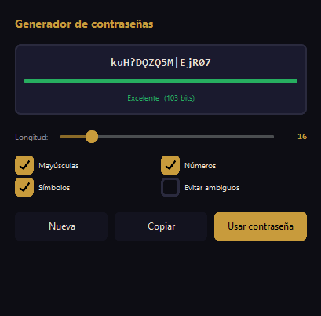
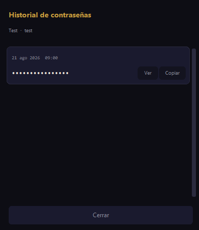
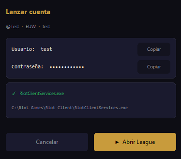
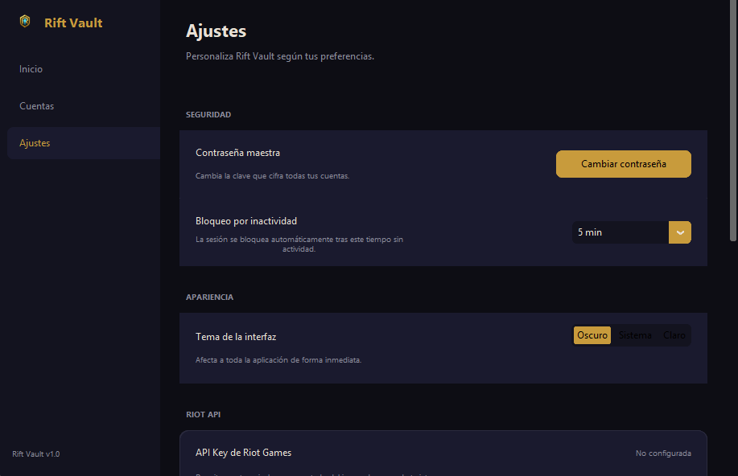
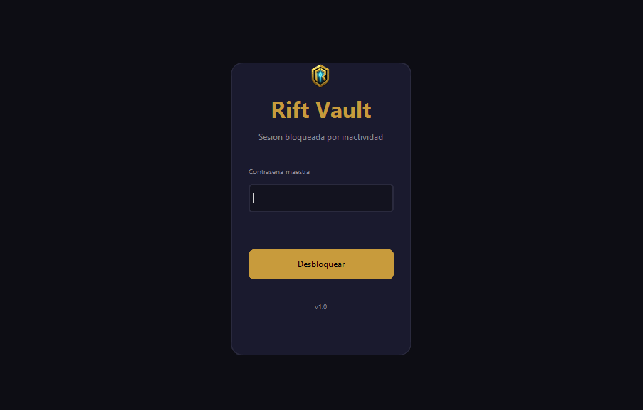
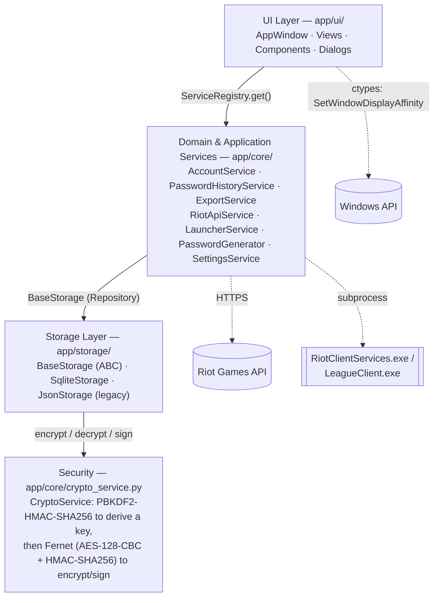
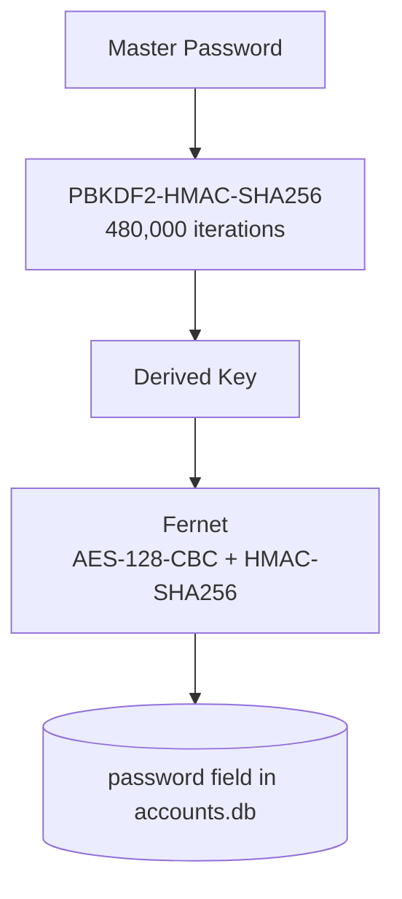

<div align="center">

# Rift Vault


**Secure League of Legends account manager for Windows.**

[](https://github.com/nleceguic/rift-vault/actions/workflows/ci.yml)
[](https://codecov.io/gh/nleceguic/rift-vault)
[](https://www.python.org/)
[](https://www.microsoft.com/windows)
[](https://github.com/TomSchimansky/CustomTkinter)
[](LICENSE)

</div>

## Table of Contents

- [Screenshots](#screenshots)
- [Features](#features)
  - [Security](#security)
  - [Threat Model](#threat-model)
- [Getting Started](#getting-started)
  - [Build executable](#build-executable)
- [Data Storage](#data-storage)
- [Tech Stack](#tech-stack)
- [Architecture](#architecture)
- [Project Structure](#project-structure)
- [Tests](#tests)
- [Roadmap](#roadmap)
- [Contributing](#contributing)
- [License](#license)

---

Rift Vault stores, organizes, and protects your LoL credentials with production-grade encryption — no cloud dependencies, no third-party services. Built with gaming-specific protections in mind: screen capture shielding for streamers, multi-account workflows, and shared physical access scenarios.

---

## Screenshots

> **TODO:** replace each placeholder below with a real screenshot (PNG, ~1280px wide) saved under `screenshots/` with the exact filename shown. Use the light or dark theme consistently across all of them, and blur/replace any real account data with sample values before committing.

<!-- TODO screenshot: unlock_view.py — master password entry screen with the unlock spinner -->
")
**Unlock screen** — master password entry / first-run setup.

<!-- TODO screenshot: home_view.py — dashboard with account stats -->

**Dashboard** — overview stats after unlocking.

<!-- TODO screenshot: accounts_view.py + filter_bar.py + account_card.py — account list -->
 at the top, ideally with a search/tag filter active")
**Accounts list** — cards with search, filters, and sorting.

<!-- TODO screenshot: account_form_dialog.py — create/edit account modal -->
 data filled in")
**Account form** — create/edit modal with alias, region, tags, and notes.

<!-- TODO screenshot: password_generator_dialog.py — generator with strength bar -->

**Password generator** — configurable length, strength bar, entropy.

<!-- TODO screenshot: password_history_dialog.py — masked history list -->

**Password history** — timestamped log with masked passwords.

<!-- TODO screenshot: launch_dialog.py — quick-launch with credential copy -->

**Quick launch** — one-click credential copy before launching the client.

<!-- TODO screenshot: settings_view.py — Security/Appearance/Riot API/Launcher/Data tabs -->

**Settings** — security, appearance, Riot API key, launcher path, data.

<!-- TODO screenshot: lock_overlay.py — inactivity lock screen -->

**Lock overlay** — shown automatically after the inactivity timeout.

---

## Features

### Account Management
- Create, edit, and delete accounts with alias, username, password, region, tags, notes, and Riot ID
- 11 regions supported: EUW, EUNE, NA, LAS, LAN, BR, OCE, KR, JP, TR, RU
- Full-text search across alias, username, notes, and tags with advanced operators (`tag:`, `region:`, `"exact phrase"`, `-exclusion`)
- Filter by region and tags with AND logic
- Sort by alias (A-Z / Z-A) or date (newest / oldest)
- Tag autocomplete when creating and editing accounts

### Secure Clipboard
- Copy username, password, or both with one click
- 30-second TTL with a live countdown on the button
- Automatic clipboard wipe on expiry
- Blocking warning when closing with a password on the clipboard

### Password Generator
- Configurable length from 8 to 64 characters (slider)
- Options: uppercase, numbers, symbols, avoid ambiguous characters
- Strength bar with rating and entropy in bits
- "Use password" button that inserts directly into the form

### Password History
- Automatic log of every password change with timestamp
- History modal with masked passwords and show/hide toggle
- Historical passwords are encrypted with the same master key

### Built-in Launcher
- Auto-detects `RiotClientServices.exe` or `LeagueClient.exe`
- Searches common paths (`C:/`, `D:/`, `E:/`), environment variables, and the Windows registry
- Custom path in Settings → Launcher with a file browser button
- Quick-launch dialog with one-click credential copy

### Riot API Integration
- Displays summoner level, rank, and account status on each card
- Local cache per account to minimize API calls
- API key configuration in Settings with show/hide toggle
- Per-card manual refresh button

### Export / Import
- **JSON v1** — encrypted with the current master password (same device)
- **JSON v2** — encrypted with a custom password (portable across installations)
- **CSV** — plaintext with an explicit warning (for migrating to other managers)
- Import with automatic format detection, pre-import summary, and duplicate validation

### Security

| Mechanism | Detail |
|---|---|
| KDF | PBKDF2-HMAC-SHA256, 480,000 iterations (OWASP 2024) |
| Credential encryption | Fernet — AES-128-CBC + HMAC-SHA256 |
| Master password verification | Encrypted Fernet canary (no exposed hash on disk) |
| Storage integrity | SQLite with per-field Fernet encryption; HMAC embedded in JSON exports |
| Passwords in memory | Never in plaintext — decrypted on-demand when copying or viewing history |
| Inactivity lock | Configurable auto-lock (5 / 10 / 15 / 30 / 60 min) with re-authentication overlay |
| Screen capture protection | `SetWindowDisplayAffinity(WDA_EXCLUDEFROMCAPTURE)` — window appears black in OBS and recording software while a password is on the clipboard |
| Rate limiting | Increasing delays (2s → 5s → 15s) after failed unlock attempts |
| Atomic writes | `.tmp` + `os.replace()` — no corruption on disk failures |
| Master password change | Re-encrypts all credentials without exposing plaintext on disk |

### Threat Model

None of the mechanisms in the table above make the system "secure" in the abstract: each one mitigates a specific threat, under specific conditions. This section makes that scope explicit.

**Protects against:**
- Reading the `password` field in `accounts.db` without the master password: each password is individually encrypted with Fernet (AES-128-CBC + HMAC-SHA256) before being stored in SQLite. *Caveat:* only that field is encrypted, not the whole row — alias, username, notes, tags, and Riot ID are stored unencrypted in the same database (see below).
- Screen capture or recording (OBS and similar) while a username or password is copied to the clipboard: `SetWindowDisplayAffinity(WDA_EXCLUDEFROMCAPTURE)` makes the window appear black in the recording while the clipboard is "armed", and it's disabled automatically once the 30s TTL expires or the session locks due to inactivity. Requires Windows 10 build 2004+; on earlier versions there's no protection (the app still works, just without this mitigation).
- Brute-forcing the master password through the app's own UI: PBKDF2-HMAC-SHA256 with 480,000 iterations raises the cost per attempt, and a progressive penalty slows down retries (attempts 1-2 no delay, attempt 3 → 2s, attempt 4 → 5s, attempt 5 onward → 15s fixed per attempt).
- Data corruption from a write interrupted mid-operation: `accounts.db` relies on SQLite's own atomic transactions (commit/rollback via journal); `accounts.json` (legacy format), `settings.json`, and JSON exports use the `.tmp` file + `os.replace()` pattern.

**Does not protect against:**
- A keylogger or other malware active on the system while the master password is typed: there's no anti-keylogging or secure-input mechanism.
- An attacker with physical access and administrator privileges while the vault is unlocked: the derived Fernet key and the HMAC signing key live in process memory while the session is active, and are recoverable via a memory dump or a debugger attached to the process.
- Losing the master password: there's no recovery mechanism by design. `master.key` only stores the salt and a Fernet-encrypted canary (never the password itself nor a reversible hash of it), so without the original password the encrypted data is unrecoverable.
- Reading the unencrypted fields of `accounts.db` by anyone with access to the file: alias, username, notes, tags, and Riot ID travel in plaintext inside the database; only `password` is encrypted. The integrity HMAC detects if those fields were modified externally, but doesn't prevent them from being read.

---

## Getting Started

### Requirements

- Python 3.11+
- Windows 10 (build 19041+) or Windows 11

> Screen capture protection (`SetWindowDisplayAffinity`) requires Windows 10 version 2004 or later. On older versions the app runs normally without that protection.

### Installation

```bash
# 1. Clone the repository
git clone https://github.com/nleceguic/rift-vault.git
cd rift-vault

# 2. Create a virtual environment
python -m venv .venv
.venv\Scripts\activate

# 3. Install dependencies
pip install -r requirements.txt

# 4. Run
python main.py
```

### Build executable

How to compile Rift Vault into a distributable Windows `.exe`, as a developer — not how to install it as a user (that's [Installation](#installation) above). There's no `.spec` file or build script in the repo yet, so this is the exact command that reproduces the current build; it must be run on Windows, since PyInstaller doesn't cross-compile.

```bash
python -m venv .venv
.venv\Scripts\activate
pip install -r requirements.txt
pip install -r requirements-dev.txt
pytest
pip install pyinstaller
pyinstaller --onefile --windowed --name RiftVault --add-data "logo.png;." main.py
```

The executable is written to:

```text
dist/RiftVault.exe
```

What each flag is doing, and why:

- `--onefile` — bundles everything into a single `.exe` (no companion folder to ship).
- `--windowed` — no console window, matching that this is a Tkinter GUI app (`main.py` calls `app.mainloop()`).
- `--add-data "logo.png;." ` — bundles `logo.png` next to the executable's extracted root. It's required: `app/config.py` resolves `LOGO_PATH` via `sys._MEIPASS` when frozen (see the `_resource()` helper), and every screen that shows the logo (`unlock_view.py`, `home_view.py`, `lock_overlay.py`, `app_window.py`) reads from that path. Without this flag the app would crash on startup with a missing-file error the moment it tries to render the logo. `;` is the Windows path separator PyInstaller expects for `--add-data` — on Linux/macOS it would be `:`, but this project only builds on Windows.
- No `--icon` — the repo doesn't currently ship an `.ico` file, so the `.exe` uses PyInstaller's default icon rather than Rift Vault's own. `logo.png` alone can't be used here; PyInstaller requires `.ico` on Windows.
- No `pywin32` and no extra `--hidden-import` were needed. Windows-specific behavior (`app/core/win32_utils.py`, `app/core/launcher_service.py`) uses only stdlib `ctypes`/`winreg`, which PyInstaller bundles automatically.

**Verified**: built and ran this exact command end to end (423/423 tests passing beforehand) — the resulting `dist/RiftVault.exe` (~28 MB) launched cleanly with an isolated `RIFT_VAULT_DATA_DIR`, the log showed `ServiceRegistry` wiring up (`CryptoService` → `SqliteStorage` → `AccountService`, etc.) with no missing-module or missing-asset errors, the logo loaded correctly through `_MEIPASS`, and `accounts.db` was created on disk. **Not verified**: the full interactive flow (setting a master password and encrypting/decrypting a real credential through the UI), Riot Client auto-detection (no League client installed on the build machine), and screen capture protection (would need a recorder running to confirm visually). Don't take those three as confirmed working in the frozen build — only the non-interactive core paths above are.

No secrets, `.env` files, databases, or logs get bundled: the build only ever pulls in `main.py`'s import graph plus the one explicit `--add-data` (`logo.png`). Runtime data (`accounts.db`, `master.key`, `settings.json`, logs) is created under `~/.rift_vault/` at first run, entirely outside the source tree PyInstaller reads from.

---

## Data Storage

All data is saved in `~/.rift_vault/` (user folder):

| File | Contents |
|---|---|
| `master.key` | Salt + encrypted Fernet canary to verify the master password |
| `accounts.db` | SQLite database with accounts, password history, and Riot API cache |
| `settings.json` | UI preferences (theme, timeout, Riot API key, launcher path) |

The master password is **never** stored — only the salt and verification token. Every sensitive field in the database is individually Fernet-encrypted. If a legacy `accounts.json` is detected, migration to SQLite happens automatically on first launch.

---

## Tech Stack

| Component | Technology |
|---|---|
| Language | Python 3.11+ |
| UI | CustomTkinter 5.2.2 |
| Encryption | cryptography 48.0.0 (Fernet / PBKDF2) |
| Database | SQLite 3 (stdlib) |
| Images | Pillow 12.2.0 |
| Theme detection | darkdetect 0.8.0 |
| Windows API | ctypes (stdlib) |
| Riot API | requests |

---

## Architecture

Rift Vault follows a layered structure: the UI pulls services from a small DI container (`ServiceRegistry`), those services depend only on the `BaseStorage` abstraction (Repository pattern) rather than a concrete database, and storage delegates all encryption to a single `CryptoService`. There's no separate domain package — domain rules (validation, the `Account` model) and application orchestration both live together in `app/core/`, so the diagram shows them as one layer rather than inventing a split that isn't in the code.



- **UI → Application** is a service-locator call (`ServiceRegistry.instance().get(...)`), not constructor injection at the call site — the container wires everything once at startup (`ServiceRegistry.build()`), UI code just looks services up by type afterwards.
- **Application → Storage** only ever references `BaseStorage`, never `SqliteStorage` directly (see `account_service.py`), so the concrete storage engine is swappable.
- **Storage → Security** is one-directional: `SqliteStorage`/`JsonStorage` hold a `CryptoService` instance and call it to encrypt the `password` field and to HMAC-sign the whole record; `CryptoService` has no knowledge of storage.
- The dotted edges are side integrations, not part of the main dependency chain: `app_window.py` calls the Windows API directly for screen capture protection (bypassing the service layer entirely), `RiotApiService` calls the external Riot API over HTTPS, and `LauncherService` spawns the League/Riot client as an OS subprocess.
- Two cross-cutting mechanisms aren't drawn as boxes to keep this readable: an `EventBus` (pub/sub, e.g. `account_card.py` emits `clipboard.armed` and `app_window.py` reacts to it) and a `HooksRegistry` (extension points fired from `account_service.py`, e.g. `before_lock`, `after_copy`). Both are internal signaling, not data-flow dependencies between layers.

Master password → encrypted vault, end to end:



This mirrors `CryptoService._derive_key()` and `.encrypt()` exactly — see [Security](#security) and [Threat Model](#threat-model) for what this does and doesn't protect against.

---

## Project Structure

```
rift-vault/
├── main.py                              # Entry point
├── requirements.txt
└── app/
    ├── config.py                        # Global constants, color palette, fonts
    ├── core/
    │   ├── account.py                   # Domain model (Account dataclass)
    │   ├── account_service.py           # Business logic, validation, CRUD
    │   ├── crypto_service.py            # PBKDF2 + Fernet + HMAC export signing
    │   ├── event_bus.py                 # Pub/sub for cross-layer communication
    │   ├── service_registry.py          # Dependency injection container
    │   ├── settings_service.py          # User preference persistence
    │   ├── password_generator.py        # Secure generation + strength evaluation
    │   ├── password_history_service.py  # Per-account password history
    │   ├── export_service.py            # Export/import JSON v1, JSON v2, CSV
    │   ├── advanced_search.py           # Search engine with operators
    │   ├── riot_api_service.py          # Riot Games API integration
    │   ├── launcher_service.py          # LoL client detection and launch
    │   ├── error_handler.py             # Global error handling
    │   └── win32_utils.py               # Windows API (capture protection)
    ├── storage/
    │   ├── base_storage.py              # Abstract repository interface
    │   ├── sqlite_storage.py            # SQLite persistence with per-field encryption
    │   └── json_storage.py              # Legacy JSON storage (auto-migration)
    ├── hooks/
    │   ├── base_hook.py                 # Extension interface
    │   └── hooks_registry.py            # Hook registry (active extensibility)
    └── ui/
        ├── app_window.py                # Root window, inactivity timer, navigation
        ├── views/
        │   ├── unlock_view.py           # Login / initial setup
        │   ├── home_view.py             # Dashboard with stats
        │   ├── accounts_view.py         # Account list and management
        │   └── settings_view.py         # Settings (Security, Appearance, Riot API, Launcher, Data)
        └── components/
            ├── account_card.py          # Individual card with copy, edit, history, launch
            ├── account_form_dialog.py   # Create/edit modal with scroll
            ├── filter_bar.py            # Advanced search, filters, sorting
            ├── lock_overlay.py          # Inactivity lock screen
            ├── change_password_dialog.py
            ├── password_generator_dialog.py
            ├── password_history_dialog.py
            ├── launch_dialog.py
            ├── tag_autocomplete.py
            └── tooltip.py
```

---

## Tests

```bash
pip install -r requirements-dev.txt
pytest
```

423 tests covering domain services, storage, encryption, advanced search, password generator, export/import, Riot API, and the launcher.

Coverage is configured in `pytest.ini` and scoped to the testable core — `app/core/`, `app/storage/`, `app/hooks/`, and `app/config.py` — currently at **82%**. `app/ui/` (views, dialogs, widgets) is deliberately excluded from that number: it's Tkinter/CustomTkinter presentation code with no automated tests, since exercising it meaningfully needs a live display rather than a unit test. Excluding it isn't hiding a gap — every other 0%-covered file (`error_handler.py`, `service_registry.py`, `win32_utils.py`) stays fully counted against the 82%, because that *is* business logic missing tests. Running plain `pytest` produces the same scoped report plus a `coverage.xml` for CI.

---

## Roadmap

Known limitations and their reasoning — not a list of promised features.

- [ ] **Cross-platform support** — Windows-only today. Two integrations are the reason, both stdlib `ctypes`/`winreg`, no `pywin32`: screen capture protection (`app/core/win32_utils.py`) calls the Win32 `SetWindowDisplayAffinity` API directly, and the launcher's client auto-detection (`app/core/launcher_service.py`) queries the Windows registry via `winreg`. Both are already guarded behind `sys.platform` checks and degrade gracefully instead of crashing, but the app is only built, tested, and packaged for Windows 10/11 — Linux/macOS support would mean an alternative to `SetWindowDisplayAffinity` (no real equivalent on X11/Wayland/macOS) and a non-registry launcher lookup.
- [ ] **Independent security audit** — the crypto and storage design (see [Security](#security) and [Threat Model](#threat-model)) has been implemented and covered by the test suite, but it has not gone through an external, independent security audit. Treat it as internally reviewed, not third-party verified.
- [ ] **Optional encrypted sync between devices** — the vault is local-only by design: everything lives in `~/.rift_vault/` (`accounts.db`, `master.key`, `settings.json`), with no backend and no account system. The one network call the app makes is to Riot's public API for summoner rank/level lookups, which is opt-in and unrelated to credential storage. Encrypted multi-device sync is a possible future direction, not a planned or in-progress feature.

---

## Contributing

PRs are welcome. For larger features or architectural changes, open an issue first to discuss the approach before writing code. Keep the test suite green — see [Tests](#tests) — and add coverage for new behavior where it makes sense.

---

## License

MIT © [nleceguic](https://github.com/nleceguic)
